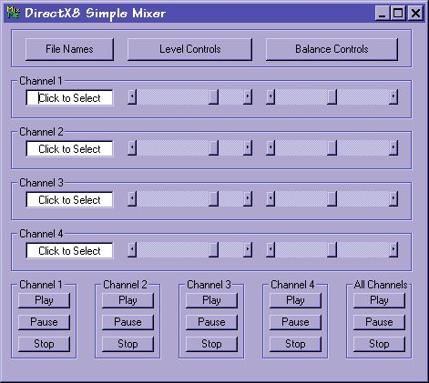



## DX8 Simple Mixer

### Description

Just a simple little 4-channel wave file mixer created as a utility tool for times when I want to hear how various wave files sound when played together. The code is documented and shows just how easy it is to make a mixer with DirectX. As usual any feedback and/or votes will be appreciated.
 
### More Info
 

             |
---                |---
**Submitted On**   |2002-03-12 11:37:42
**By**             |[Michael Hebert](https://github.com/Planet-Source-Code/PSCIndex/blob/master/ByAuthor/michael-hebert.md)
**Level**          |Beginner
**User Rating**    |5.0 (15 globes from 3 users)
**Compatibility**  |VB 6\.0
**Category**       |[Sound/MP3](https://github.com/Planet-Source-Code/PSCIndex/blob/master/ByCategory/sound-mp3__1-45.md)
**World**          |[Visual Basic](https://github.com/Planet-Source-Code/PSCIndex/blob/master/ByWorld/visual-basic.md)
**Archive File**   |[DX8\_Simple616653122002\.zip](https://github.com/Planet-Source-Code/michael-hebert-dx8-simple-mixer__1-32623/archive/master.zip)

